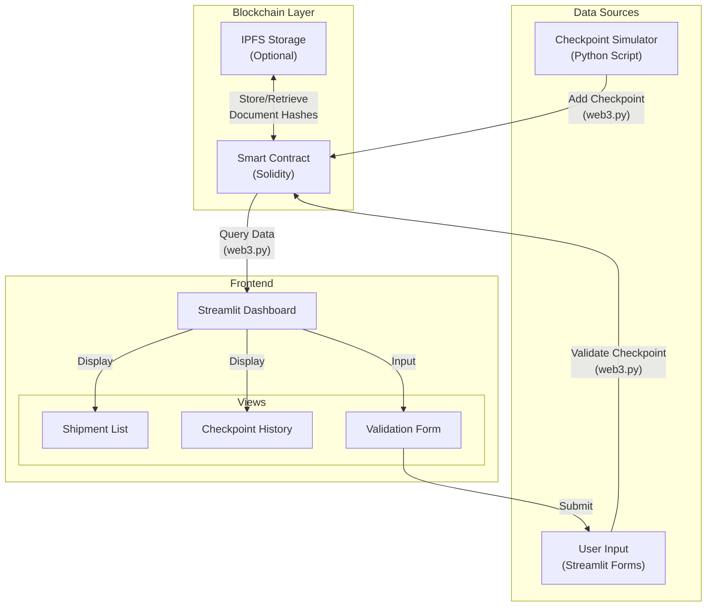

# System Architecture

## Component Diagram

## System Flow

1. **Data Input**:
   - Checkpoints are added either by the simulation script or by users through the Streamlit interface
   - Each checkpoint includes location, timestamp, validator address, status, and optional document hash

2. **Blockchain Storage**:
   - The Ethereum smart contract stores checkpoint data in an immutable ledger
   - Document hashes can be stored on-chain, while actual documents are stored in IPFS

3. **Frontend Display**:
   - The Streamlit dashboard queries the smart contract to display shipment and checkpoint data
   - Users can view complete history of a shipment's journey
   - Authorized users can add new checkpoints and validate existing ones

4. **Verification**:
   - All transactions are cryptographically signed by the validator
   - The immutable nature of the blockchain ensures data cannot be tampered with
   - Optional document hashes provide additional verification 